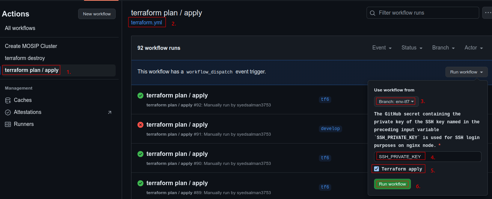
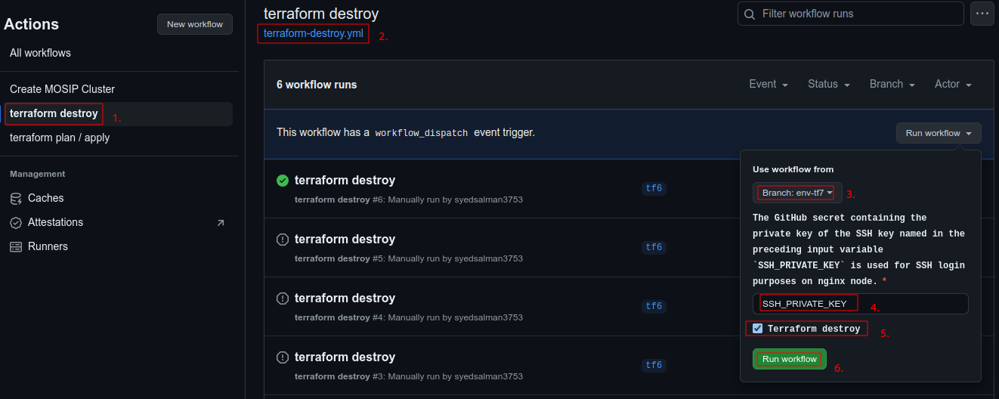

# Terraform Setup for MOSIP Infrastructure via GitHub Actions

## Create MOSIP Infrastructure 

### Prerequisites
* Create a new branch `env-<environment_name>` from master/develop branch.
* Goto `terraform/aws` location and update environment related details in `env.tfvars` file.

### Run `terraform plan / apply` workflow to set up MOSIP infrastructure
* This GitHub Action automates the Terraform workflow,
  allowing users to run `terraform plan` and optionally `terraform apply` commands within a CI/CD pipeline.
  The workflow is triggered manually via workflow_dispatch.
* To trigger this workflow, go to the `Actions` tab in your GitHub repository. Select `terraform plan / apply` workflow and provide the required inputs and click `Run workflow` to start the workflow.
  

### Inputs
* `SSH_PRIVATE_KEY (required)`: GitHub secret name containing the private key for SSH login on the nginx node.
* `TERRAFORM_APPLY (optional)`: Boolean flag to apply the Terraform plan. Defaults to false.

### Environment Variables
* `AWS_ACCESS_KEY_ID`: The AWS access key ID used for authenticating with AWS services. This is stored as a GitHub secret `AWS_ACCESS_KEY_ID`.
* `AWS_SECRET_ACCESS_KEY`: The AWS secret access key corresponding to the AWS access key ID. This is stored as a GitHub secret `AWS_SECRET_ACCESS_KEY`.
* `TF_VAR_SSH_PRIVATE_KEY`: The SSH private key used for accessing nginx server. This is referenced from the input `SSH_PRIVATE_KEY` and stored as a GitHub secret.

## Destroy MOSIP Infrastructure

### Run `terraform destroy` workflow 
* This GitHub Action automates the `Terraform destroy` command within a CI/CD pipeline.
The workflow can be manually triggered to destroy infrastructure managed by Terraform.
* To trigger this workflow, go to the `Actions` tab in your GitHub repository. Select `terraform destroy` workflow and provide the required inputs and click `Run workflow` to start the workflow.
  

### Inputs
* `SSH_PRIVATE_KEY (required)`: GitHub secret name containing the private key for SSH login on the nginx node.
* `TERRAFORM_DESTROY (optional)`: Boolean flag to determine whether to execute the Terraform destroy command. Defaults to false.

### Environment Variables
* `AWS_ACCESS_KEY_ID`: The AWS access key ID used for authenticating with AWS services. This is stored as a GitHub secret `AWS_ACCESS_KEY_ID`.
* `AWS_SECRET_ACCESS_KEY`: The AWS secret access key corresponding to the AWS access key ID. This is stored as a GitHub secret `AWS_SECRET_ACCESS_KEY`.
* `TF_VAR_SSH_PRIVATE_KEY`: The SSH private key used for accessing nginx server. This is referenced from the input `SSH_PRIVATE_KEY` and stored as a GitHub secret.

# Terraform Setup for MOSIP Infrastructure

## Overview
This Terraform configuration script set up the infrastructure for MOSIP (Modular Open Source Identity Platform) on AWS.
The setup includes security groups, an NGINX server, and a Kubernetes (K8S) cluster.

## Requirements
* Terraform version: `v1.8.4`
* AWS Account
* AWS CLI configured with appropriate credentials
  ```
  $ export AWS_ACCESS_KEY_ID=<AWS_ACCESS_KEY_ID>
  $ export AWS_SECRET_ACCESS_KEY=<AWS_SECRET_ACCESS_KEY>
  $ export TF_VAR_SSH_PRIVATE_KEY=<EC2_SSH_PRIVATE_KEY>
  ```

## Files
* `main.tf`: Main Terraform script that defines providers, resources, and output values.
* `variables.tf`: Defines variables used in the Terraform scripts.
* `outputs.tf`: Provides the output values.
* `locals.tf`: Defines a local variable `SECURITY_GROUP` containing configuration parameters required for setting up security groups for Nginx and Kubernetes cluster nodes.
* `env.tfvars`: tfvars file is used to set the actual values of the variables.

## Setup
* Initialize Terraform.
  ```
  terraform init
  ```
* Review and modify variable values:
    * Ensure `locals.tf` contains correct values for your setup.
    * Update values in `env.tfvars` as per your organization requirement.
* Terraform validate & plan the terraform scripts:
  ```
  terraform validate
  ```
  ```
  terraform plan -var-file="./env.tfvars
  ```
* Apply the Terraform configuration:
  ```
  terraform apply -var-file="./env.tfvars
  ```

## Destroy
To destroy AWS resources, follow the steps below:
* Ensure to have `terraform.tfstate` file.
  ```
  terraform destroy -var-file=./env.tfvars
  ```

## Modules

#### aws-resource-creation
This module is responsible for creating the AWS resources needed for the MOSIP platform, including security groups, an NGINX server, and a Kubernetes cluster nodes.

* Inputs:
  * `CLUSTER_NAME`: The name of the Kubernetes cluster.
  * `AWS_PROVIDER_REGION`: The AWS region for resource creation.
  * `SSH_KEY_NAME`: The name of the SSH key for accessing instances.
  * `K8S_INSTANCE_TYPE`: The instance type for Kubernetes nodes.
  * `NGINX_INSTANCE_TYPE`: The instance type for the NGINX server.
  * `MOSIP_DOMAIN`: The domain name for the MOSIP platform.
  * `ZONE_ID`: The Route 53 hosted zone ID.
  * `AMI`: The Amazon Machine Image ID for the instances.
  * `SECURITY_GROUP`: Security group configurations.

#### nginx-setup
This module sets up NGINX and configures it with the provided domain and SSL certificates.

* Inputs:
  * `NGINX_PUBLIC_IP`: The public IP address of the NGINX server.
  * `MOSIP_DOMAIN`: The domain name for the MOSIP platform.
  * `MOSIP_K8S_CLUSTER_NODES_PRIVATE_IP_LIST`: List of private IP addresses of the Kubernetes nodes.
  * `MOSIP_PUBLIC_DOMAIN_LIST`: List of public domain names.
  * `CERTBOT_EMAIL`: The email ID for SSL certificate generation.
  * `SSH_KEY_NAME`: SSH private key used for login (i.e., file content of SSH pem key).

## Outputs
The following outputs are provided:

* `K8S_CLUSTER_PUBLIC_IPS`: The public IP addresses of the Kubernetes cluster nodes.
* `K8S_CLUSTER_PRIVATE_IPS`: The private IP addresses of the Kubernetes cluster nodes.
* `NGINX_PUBLIC_IP`: The public IP address of the NGINX server.
* `NGINX_PRIVATE_IP`: The private IP address of the NGINX server.
* `MOSIP_NGINX_SG_ID`: The security group ID for the NGINX server.
* `MOSIP_K8S_SG_ID`: The security group ID for the Kubernetes cluster.
* `MOSIP_K8S_CLUSTER_NODES_PRIVATE_IP_LIST`: The private IP addresses of the Kubernetes cluster nodes.
* `MOSIP_PUBLIC_DOMAIN_LIST`: The public domain names.

# Terraform fetch variables via ENV variables

```
$ export TF_VAR_CLUSTER_NAME=dev
$ export TF_LOG="DEBUG"
$ export TF_LOG_PATH="/tmp/terraform.log"
```

* TF_VAR_ : is a syntax
* CLUSTER_NAME=dev : is variable and its value

